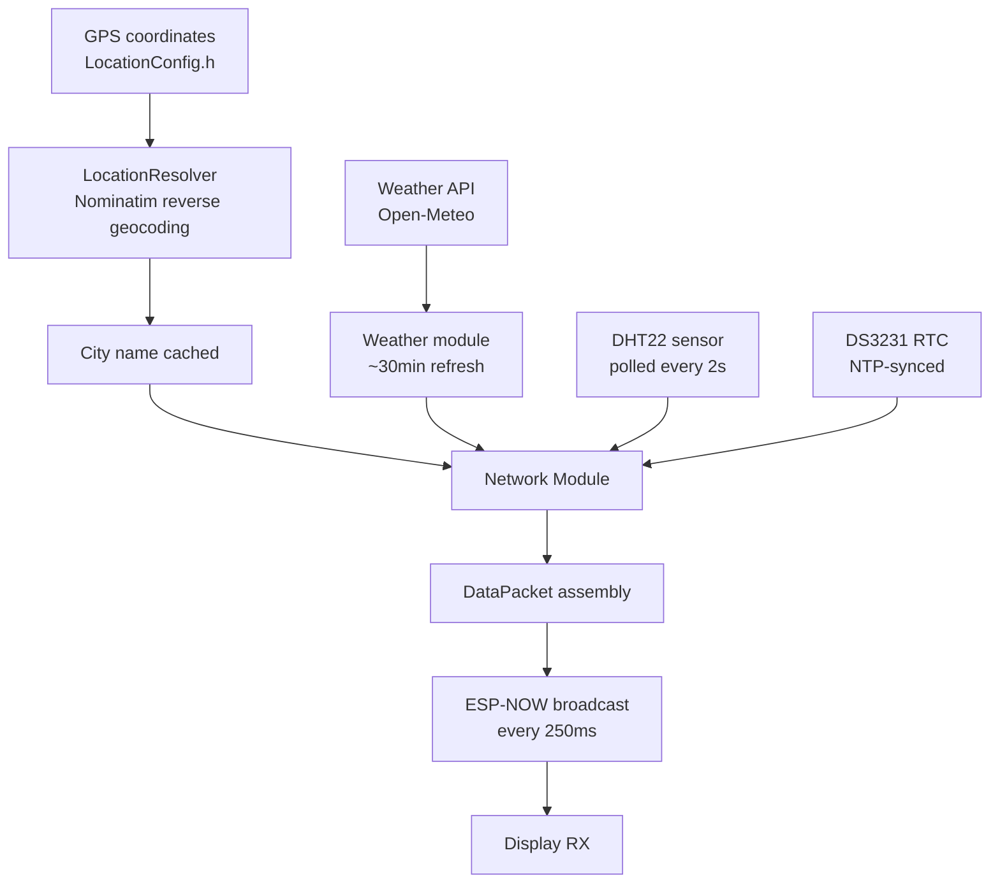
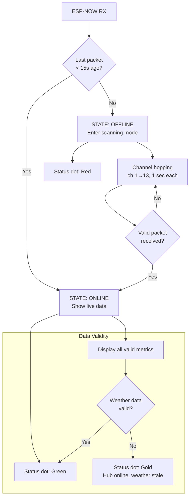
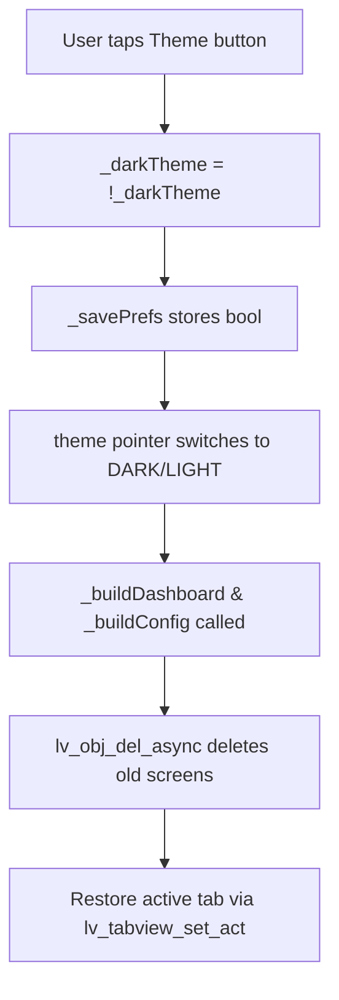

# AmbiSense Architecture

## Overview

AmbiSense is a dual-device local-first weather and room sensor display system:

- Hub (ESP32 WROOM-32): Fetches live weather via Wi-Fi, resolves city name from GPS coordinates, aggregates room sensors, broadcasts via ESP-NOW
- Display (ESP32-2432S028 CYD): Receives broadcast, renders LVGL dashboard with auto-centering, allows user config

Both devices are independent. They can develop and test separately. Modules in the Hub live under `AmbiSense::Hub`. Modules in the Display live under `AmbiSense::Display`. Communication uses ESP-NOW without a router.

---

## Hub Architecture

### Hardware

- ESP32 (WROOM-32)
- DHT22 (temperature/humidity sensor)
- DS3231 (real-time clock)
- Wi-Fi antenna
- USB power or 5V battery

### Modules

**Network** (include/network/network.h / src/network/network.cpp)

The Network module handles ESP-NOW reception. It parses DataPackets from the Hub. It auto-syncs the Wi-Fi channel: it locks to the Hub's Wi-Fi channel on the first packet.

The Display detects offline state by checking packet timestamps. If no valid DataPacket arrives for 15 seconds, it enters a scanning state. It hops through Wi-Fi channels 1 to 13, one each second, until it finds the Hub. When a packet arrives, the Display locks to that channel and resumes normal operation.

The module sends ConfigPackets to update credentials. It sends CmdPackets for commands like force NTP sync. It loads and saves credentials from NVS using the Preferences API with the namespace "ambisense".

**Weather** (include/services/weather/weather.h / src/services/weather/weather.cpp)

The Weather module fetches current weather from the Open-Meteo API. This API is free and does not need a key. It handles retries with linear backoff: 2s, 4s, 6s. Maximum 3 retries. It caches weather data and refreshes every 30 minutes (WEATHER_INTERVAL_MS). It returns a WeatherData struct with temperature, humidity, pressure, wind, sunrise, sunset, and WMO code. The module runs in a FreeRTOS task in the background. It uses a mutex for thread-safe access.

**LocationResolver** (include/services/location/location_resolver.h / src/services/location/location_resolver.cpp)

The LocationResolver resolves a city name from GPS coordinates using Nominatim, the OpenStreetMap reverse geocoding service. It queues the fetch from `Network::_buildDataPacket` and does the fetch from `update()`, rate-limited. It caches the result. If the lookup fails, it falls back to "Unknown". The module is thread-safe and needs no API key. It uses a proper User-Agent header.

**Sensors** (include/sensors/sensors.h / src/sensors/sensors.cpp)

The Sensors module polls the DHT22 every 2 seconds (DHT_INTERVAL_MS). It reads temperature and humidity. It caches the last valid reading and marks it invalid if a read fails. The validity check is `!isnan(temp) && !isnan(humidity)`.

**RTCManager** (include/time/rtc_manager.h / src/time/rtc_manager.cpp)

The RTCManager interfaces with the DS3231 real-time clock. It provides an accurate timestamp independent of WiFi. It implements an NTP sync state machine: IDLE -> SYNCING -> DONE / FAILED. It syncs with NTP when WiFi and internet are available. It also does a daily scheduled sync at a configurable time, default 12:00. The RTCManager is the source of truth for all timestamps in DataPackets.

**Main Loop** (src/main.cpp)

The main loop runs three tasks:

1. `sensors.update()` polls the DHT22 if the interval has elapsed.
2. `rtc.update(millis(), network.isConnected(), network.getNTPServer())` checks and performs NTP sync.
3. `network.update()` maintains WiFi and broadcasts a DataPacket every 250ms.

### Data Flow (Hub)



### Packet Structure

All packet definitions are in `include/config/PacketProtocol.h` (shared between Hub and Display).

**DataPacket** (Hub to Display, broadcast every 250ms, 108 bytes)

```
uint8_t  type              // PACKET_TYPE_DATA (0x01)
uint8_t  seq               // Rolling sequence (0 to 255)
uint8_t  channel           // Wi-Fi channel (for Display auto-sync)
uint8_t  wifiConnected     // 1 = Hub on Wi-Fi, 0 = offline
uint32_t timestamp         // Unix timestamp from RTC

// Location
uint8_t  locationValid     // 1 = city name valid, 0 = unknown
char     city[33]          // City name (e.g., Bangkok)

// Weather
uint8_t  weatherValid
uint8_t  weatherCode       // WMO code
float    outsideTemp       // Degrees Celsius
float    apparentTemp      // Feels like temperature
uint8_t  outsideHumi       // Percent
uint16_t outsidePress      // hPa
float    windSpeed         // km/h
int16_t  windDirection     // degrees (0 to 360)
char     sunrise[8]        // HH:MM
char     sunset[8]         // HH:MM

// Room
uint8_t  roomValid
float    roomTemp          // Degrees Celsius
float    roomHumi          // Percent
```

**ConfigPacket** (Display to Hub, on demand, 163 bytes)

- SSID (32 bytes), password (63 bytes), NTP server (63 bytes), seq

**CmdPacket** (Display to Hub, on demand, 3 bytes)

- type (1), cmd (1), seq (1)

**AckPacket** (bidirectional)

- Echoes the seq of the received packet

---

## Display Architecture

### Hardware

- ESP32-2432S028 CYD (Cheap Yellow Display)

- Built-in ESP32
- 2.8 inch 320x240 ILI9341 IPS TFT LCD
- XPT2046 resistive touch controller
- SPI interface
- USB power or barrel jack (5V)

### Modules

**DisplayManager** (include/display/display_manager.h / src/display/display_manager.cpp)

The DisplayManager initializes LVGL and handles its lifecycle. It uses the TFT_eSPI driver for LCD rendering. It handles XPT2046 touch input. It provides `isTouched()` and `getTouch()` for UI event handling. The frame rate is about 60 FPS through LVGL.

**Network** (include/network/network.h / src/network/network.cpp)

The Network module on the Display handles ESP-NOW reception. It parses DataPackets from the Hub. It auto-syncs the Wi-Fi channel based on the Hub's channel. It detects offline state using packet timestamp validity. It sends ConfigPackets to update credentials. It sends CmdPackets for commands like force NTP sync. It loads and saves credentials from NVS using the Preferences API with the namespace "ambisense".

**UI** (include/display/ui.h / src/display/ui.cpp)

The UI module renders the LVGL v8.4.0 dashboard on the 320x240 IPS TFT. It uses auto-centering: all UI rows recalculate positions on every update based on actual text width using empirically-determined gap values. It has two screens:

- DASHBOARD: Weather card, room sensors, time/date, status dot
- CONFIG: Two tabs

- Tab 1: Wi-Fi and NTP input fields with persistent credentials, force sync button, show password toggle
- Tab 2: Dark and light theme toggle, show and hide seconds, date format dropdown

The UI supports dual themes (dark and light) with persistent palettes. It uses non-blocking updates; all rendering is deferred to `update()` calls. It uses touch input callbacks for buttons and text fields. It defines two palettes: DARK (default) and LIGHT. The fonts are Montserrat (various sizes), Inconsolata (14px and 16px), and Material Design icons.

**UI Features**

- Show Password: toggles password visibility with an eye icon (open or closed)
- Persistent Credentials: SSID, Password, NTP server are saved to NVS
- Auto-Scroll: text fields scroll into view when focused
- Tab Change: the keyboard hides automatically when switching tabs

**WeatherTypes** (include/weather/weather_types.h / src/weather/weather_types.cpp)

The WeatherTypes module defines shared structs: WeatherInfo and UNKNOWN_WEATHER. It provides helper functions for icon lookup and WMO code mapping. It also converts wind direction from degrees to cardinal direction.

**Main Loop** (src/main.cpp)

The main loop runs three tasks:

1. `display.update()` handles LVGL and processes touch input.
2. `network.update()` receives DataPackets.
3. Every 100ms: `ui.update(pkt, network.isOnline())` refreshes the dashboard with the latest DataPacket.

### Data Flow (Display)

```mermaid
flowchart TD
    RX[ESP-NOW RX<br>every 250ms] --> Check{No packet<br>for 15s?}
    Check -->|Yes| Scan[Channel hopping scan<br>ch 1–13, 1 sec each]
    Check -->|No| Lock[Lock to Hub channel]
    Scan --> Lock
    Lock --> Store[DataPacket stored in g_lastPkt<br>mutex-protected]
    Store --> UI[UI::update() every 100ms]
    
    UI --> Format[Format time/date<br>HH:MM:SS optional]
    UI --> Icon[Select weather icon<br>based on WMO code]
    UI --> Center[Auto-center each row]
    UI --> Display[Display all metrics]
    UI --> Theme[Update theme colors]
    UI --> Dot[Calculate status dot<br>Green/Gold/Red]
    
    Center --> Rows[Weather icon+temp<br>Weather condition<br>Location icon+city<br>Humidity+pressure<br>Wind speed+direction<br>Sunrise+sunset<br>Room temp+humidity]
    
    Display --> Render[LVGL render queue]
    Render --> LCD[(320×240 IPS TFT)]
```

### Offline Detection and Recovery



| State | Condition | Behavior |
|---|---|---|
| ONLINE | Packet received within 15s | Live data displayed, status dot green |
| STALE | Packet received but weatherValid=0 | Metrics show placeholders, dot gold |
| OFFLINE | No packet for 15s | Channel scanning active (ch 1 to 13 loop), dot red |

**Recovery Process**

1. The Display detects missing packets via `Network::_lastPacketMs`, checked in `Network::update()`.
2. It enters scanning mode and hops channels every second.
3. It locks to the first channel that receives a valid DataPacket.
4. It resumes normal operation with live data.

**Note:** The Hub has no offline detection. It broadcasts continuously regardless of internet connectivity.

### UI Auto-Centering

All rows in `_updateDashboard()` recalculate positions on every update:

| Row | Components | Gap Values (from UIConfig.h) |
|---|---|---|
| 1 | Weather icon + temp | R1_ICON_GAP = 5, R1_X_OFFSET = -2 |
| 2 | Weather condition | Container-based, auto-marquee if text too long |
| 3 | Location icon + city | R3_ICON_GAP = 1, R3_X_OFFSET = -3 |
| 5 | Humidity icon + value + spacer + Pressure icon + value | R5_HUMI_GAP = 0, R5_PAIR_GAP = 10, R5_PRESS_GAP = 4, R5_X_OFFSET = -4 |
| 6 | Wind icon + value | R6_ICON_GAP = 4, R6_X_OFFSET = -3 |
| 7 | Sunrise icon + value + spacer + Sunset icon + value | R7_ICON_GAP = 4, R7_PAIR_GAP = 10, R7_X_OFFSET = -3 |
| 8 | Room temp icon + value + spacer + Room humidity icon + value | R8_TEMP_GAP = 0, R8_PAIR_GAP = 11, R8_HUMI_GAP = 0, R8_X_OFFSET = -4 |

Position formula: `sx = (VDIV_X - total_width) / 2 + offset`

### UI State

**Palette** struct with theme colors:

- Dark theme (default): black background, white text, orange, blue, and green accents
- Light theme: light gray background, dark text, adjusted colors

**Screen enum**: DASHBOARD, CONFIG

**Global state** (mutex-protected in main.cpp):

- `g_lastPkt`: the last received DataPacket
- `g_lastPktMs`: timestamp of the last packet in milliseconds

**Timeout behavior**: the Display uses `pkt.timestamp` validity. If the timestamp is invalid, it shows placeholders.

---

## Communication Protocol

### Packet Types

- PACKET_TYPE_DATA (0x01): Hub broadcasts every 250ms
- PACKET_TYPE_CONFIG (0x02): Display sends credential updates
- PACKET_TYPE_ACK (0x03): Either device echoes the seq
- PACKET_TYPE_CMD (0x04): Display sends commands (e.g., force NTP sync)

### Commands

- CMD_FORCE_NTP_SYNC (0x01): Hub immediately syncs RTC with NTP

### ESP-NOW Details

- Broadcast address: `{0xFF, 0xFF, 0xFF, 0xFF, 0xFF, 0xFF}`
- No encryption
- Display auto-locks to the Hub's Wi-Fi channel on the first packet
- Works even if the Hub has no internet
- Typical latency is less than 50ms

### Offline Detection

- The Display checks `pkt.timestamp >= 1000000000UL` (Unix epoch threshold)
- If the timestamp is invalid, it shows placeholders (`--°C`, `Unknown`, etc.)
- The status dot turns red when the `hubOnline` flag is false
- `STALE_DATA_TIMEOUT_MS` (5000) marks weather and room data stale when no valid packet arrives within that window

---

## Configuration Files

### Shared: PacketProtocol.h

The `PacketProtocol.h` file defines protocol constants, packet types, packet structs, and command IDs. It is shared by both Hub and Display.

- PACKET TYPES: DATA, CONFIG, ACK, CMD
- COMMAND IDs: CMD_FORCE_NTP_SYNC
- ESP-NOW broadcast address
- PACKET STRUCTS: DataPacket, ConfigPacket, AckPacket, CmdPacket

### Hub: HubConfig.h

- TIME: GMT_OFFSET_SEC = 7 * 3600 (UTC+7), DAYLIGHT_OFFSET_SEC = 0, TARGET_SYNC_HOUR = 12, TARGET_SYNC_MINUTE = 0
- WEATHER: WEATHER_INTERVAL_MS = 1800000 (30 min), WEATHER_RETRY_DELAY_MS = 2000, WEATHER_MAX_RETRIES = 3
- LOCATION: LOCATION_RETRY_INTERVAL_MS = 5000, LOCATION_MAX_RETRIES = 10
- INTERVALS: DHT_INTERVAL_MS = 2000, BROADCAST_INTERVAL_MS = 250, SYNC_CHECK_INTERVAL_MS = 1000
- TIMEOUTS: WIFI_CONNECT_TIMEOUT_MS = 15000, WIFI_RETRY_INTERVAL_MS = 30000

### Display: DisplayConfig.h

- BRIGHTNESS: BRIGHTNESS_MIN_PERCENT = 5, BRIGHTNESS_MAX_PERCENT = 100
- INTERVALS: SCAN_HOP_INTERVAL_MS = 1000
- TIMEOUTS: HUB_OFFLINE_TIMEOUT_MS = 15000, STALE_DATA_TIMEOUT_MS = 5000

### Shared: LogConfig.h

- `LOG_ENABLED`: master compile-time gate for the `LOG_*` macros

### Log Channels

Channels live in `include/log/log.h`. Each firmware defines its own `Log::Ch` enum:

- Display: CH_SYS, CH_NET, CH_DSP, CH_UI
- Hub: CH_SYS, CH_NET, CH_GEO, CH_WEA, CH_SNR, CH_RTC

### Device-Specific: HardwareConfig.h

**Hub** pins:

- DHT22: GPIO 25
- DS3231 I2C: SDA GPIO 33, SCL GPIO 32

**Display** pins (touch, from `HardwareConfig.h`):

- TOUCH_CS: 33
- TOUCH_IRQ: 36
- TOUCH_MOSI: 32
- TOUCH_MISO: 39
- TOUCH_CLK: 25

> TFT pins are defined in `User_Setup.h`, not `HardwareConfig.h`.

### User-Editable: LocationConfig.h

- LOCATION_LAT, LOCATION_LON: coordinates for the weather API and reverse geocoding
- Note: LocationResolver uses the Nominatim API with no API key

### UI Layout: UIConfig.h

The `UIConfig.h` file defines all UI layout constants:

- Screen dimensions (320x240)
- Clock size and position
- Row offsets (empirical centering values)
- Row gaps (empirical spacing values)
- Derived constants (CLK_X, CLK_Y, VDIV_X)

---

## Timeout Constants

All timeout values are defined in `Config.h` and shared between Hub and Display:

| Constant | Value | Description |
|---|---|---|
| HUB_OFFLINE_TIMEOUT_MS | 15000 | Time without DataPacket before the Display assumes the Hub is offline |
| STALE_DATA_TIMEOUT_MS | 5000 | Time after which weather and room data is considered stale |
| WIFI_CONNECT_TIMEOUT_MS | 15000 | Maximum time to wait for a Wi-Fi connection |
| WIFI_RETRY_INTERVAL_MS | 30000 | Backoff between Wi-Fi reconnection attempts |
| NTP_SYNC_TIMEOUT_DELAY_MS | 10000 | Per-attempt timeout for NTP sync |
| NTP_SYNC_MAX_RETRIES | 6 | Maximum NTP sync attempts before giving up |
| SCAN_HOP_INTERVAL_MS | 1000 | Time between channel hops during Display scanning |
| SYNC_CHECK_INTERVAL_MS | 1000 | RTC sync state machine check frequency |

These constants are tuned for reliability. Adjusting them may affect system responsiveness.

---

## Design Patterns

### Runtime Log Levels and Channels

Log output uses a compile-time master gate (`LOG_ENABLED`) plus two runtime masks: a level mask and a channel mask. Call sites use `LOG_D(channel, fmt, ...)`, `LOG_I`, `LOG_W`, or `LOG_E`. When `LOG_ENABLED` is 0, the macros expand to nothing and the arguments are not evaluated.

Levels are `D`, `I`, `W`, `E`. Default mask is `I | W | E`. Debug is off.

Channels and levels are enabled at runtime via `Log::setChannel()` and `Log::setLevel()`. State lives in two 8-bit masks. Use `Log::dump()` to print both masks and per-entry state.

Each firmware defines its own channel list. The Hub has six. The Display has four.

### Non-Blocking Architecture

- No `delay()` calls
- All timing uses `millis()`
- Sensor reads are polled on demand
- Commands process asynchronously
- Weather fetch runs in a FreeRTOS task and does not block the main loop

### Graceful Offline Fallback

- The Display shows placeholders if the Hub timestamp is invalid
- The UI does not freeze or hang
- The system syncs automatically when the Hub comes back online

### NVS Storage

- Hub: credentials in the "ambisense" namespace
- Display: credentials in the "ambisense" namespace
- Display: UI preferences (theme, seconds, date format, saved SSID, password, NTP) in the "ui_prefs" namespace
- Loaded once on boot and updated on config change
- Persistent across power cycles

### Channel Auto-Sync

- The Display locks to the Hub's Wi-Fi channel on the first DataPacket
- This simplifies ESP-NOW discovery without scanning
- The system survives Wi-Fi channel changes

### Broadcast-Only ESP-NOW

- This approach is simpler than point-to-point because it does not need pairing
- The Hub sends continuously; the Display receives
- It works even if the Display has not been introduced to the Hub yet

### FreeRTOS Task for Weather

- Weather fetching runs in a background task
- This prevents blocking the main loop on network latency
- Access is thread-safe via a mutex

### Reverse Geocoding

- LocationResolver fetches the city name once at boot from OpenStreetMap Nominatim
- The result is cached forever because the city name does not change
- No repeated API calls
- Falls back gracefully to "Unknown" if the API fails

### Auto-Centering UI

- Each UI row recalculates its position on every update
- It uses actual text width after `lv_obj_update_layout()`
- Gap values are empirically determined (measured in Paint)
- This ensures perfect centering even when text length changes (e.g., "25.0°C" vs "26.3°C")

### Theme Switching Implementation

The UI supports Dark and Light theme switching with persistent preferences stored in NVS.

**Theme Switch Flow**



**Palette Structure**

```
struct Palette {
    uint32_t bg;          // Background color
    uint32_t text;        // Primary text
    uint32_t text_invert; // Text on colored backgrounds
    uint32_t subtext;     // Secondary text (dimmed)
    uint32_t dim;         // UI element backgrounds
    uint32_t unknown;     // Unknown label color
    uint32_t settings;    // Settings icon color
    uint32_t red;         // Status dot: offline
    uint32_t location;    // Location icon
    uint32_t deep_orange; // Sunset icon
    uint32_t orange;      // Minute hand
    uint32_t gold;        // Sunrise icon
    uint32_t green;       // Status dot: online
    uint32_t wind;        // Wind icon
    uint32_t online;      // Status dot: valid data
    uint32_t pastel_blue; // Pressure icon
    uint32_t sky_blue;    // Humidity icon
};
```

**Async Screen Deletion**

When switching themes, both dashboard and config screens are rebuilt:

```
// Old screens are deleted asynchronously to prevent crashes
if (oldDash) lv_obj_del_async(oldDash);
if (oldConfig) lv_obj_del_async(oldConfig);
```

`lv_obj_del_async()` schedules deletion for the next LVGL tick. This prevents deletion during active rendering cycles and avoids memory corruption.

**Persistent Preferences**

Theme, date format, and seconds visibility are stored in NVS:

| Key | Type | Default |
|---|---|---|
| darkTheme | bool | true |
| dateFmtText | bool | true |
| showSeconds | bool | false |
| savedSSID | string | "" |
| savedPass | string | "" |
| savedNTP | string | "pool.ntp.org" |

---

## Performance

| Metric | Value |
|---|---|
| ESP-NOW latency | less than 50ms |
| DataPacket broadcast | 250ms (4 Hz) |
| DHT22 polling | 2 seconds |
| Weather refresh | about 30 minutes |
| Display refresh | about 60 FPS (LVGL) |
| UI update | Every 100ms |
| LocationResolver fetch | Once at boot (about 500ms) |
| Power (Hub) | about 1W idle, about 1.5W active |
| Power (Display) | about 0.8W idle, about 1.2W active |
| Total system | about 2W continuous |

---

## Troubleshooting

**Display shows offline (red dot)**

- The Hub may not be broadcasting.
- Check the Hub serial output for errors.
- Verify both devices are on the same 2.4GHz Wi-Fi band.
- Hard reset both devices.

**Weather does not update**

- Check the Hub with `pio device monitor -b 115200` and look for API errors.
- Verify the Wi-Fi connection on the Hub.
- Ensure NTP sync completed. Check the Hub serial for sync messages.

**Time is incorrect**

- Verify the Hub's NTP sync. Check the serial for "NTP sync complete".
- Ensure the NTP server is reachable.
- Check the timezone in `Config.h` (default is UTC+7).

**Config changes do not persist**

- NVS save may fail due to flash wear.
- Try erasing NVS and reflashing: `pio run -t erase`.
- Check the serial output for NVS errors.

**Display cannot connect to Hub**

- Verify both devices are on the same 2.4GHz Wi-Fi network.
- Hard reset both devices: power cycle and reflash if needed.
- Check ESP-NOW init in the serial logs. Both devices should print init messages.

**City name shows "Unknown"**

- Check the LocationResolver serial output: `[GEO] Location: ...` or `[GEO] Location lookup failed`.
- Verify `LOCATION_LAT` and `LOCATION_LON` in `LocationConfig.h` are correct.
- Ensure the Hub has internet during boot. Geocoding needs an API call.
- The Nominatim API is free but needs a valid User-Agent header. The header is already set.

**UI elements misaligned**

- Auto-centering recalculates on each update.
- Gap values are empirical. Adjust constants in `UIConfig.h` if needed.
- Ensure `_buildDashboard()` and `_updateDashboard()` use the same gap values.

**Keyboard covers text fields**

- Dynamic padding should handle this.
- Check the `_onTaEvent` callback if padding is not restored properly.

---

## Current Status

- Both Hub and Display are fully functional.
- The clock syncs via NTP. Sensors read and transmit data.
- The UI renders live with dual themes and auto-centering.
- The brightness slider has live preview and NVS persistence.
- LocationResolver fetches the city name from GPS coordinates.
- Offline mode shows placeholders when the Hub timestamp is invalid.
- The Show Password button toggles with an eye icon.
- SSID, Password, and NTP server persist across reboots.
- Tab changes hide the keyboard automatically.
- The system is ready for deployment.