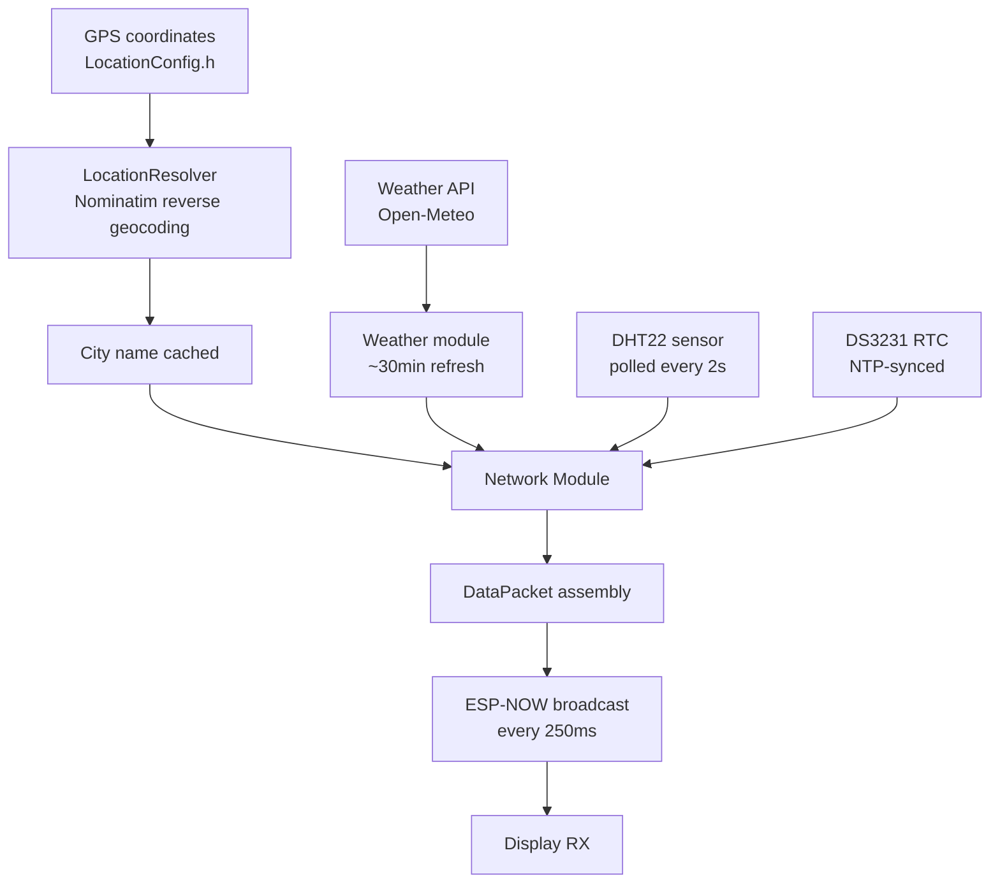
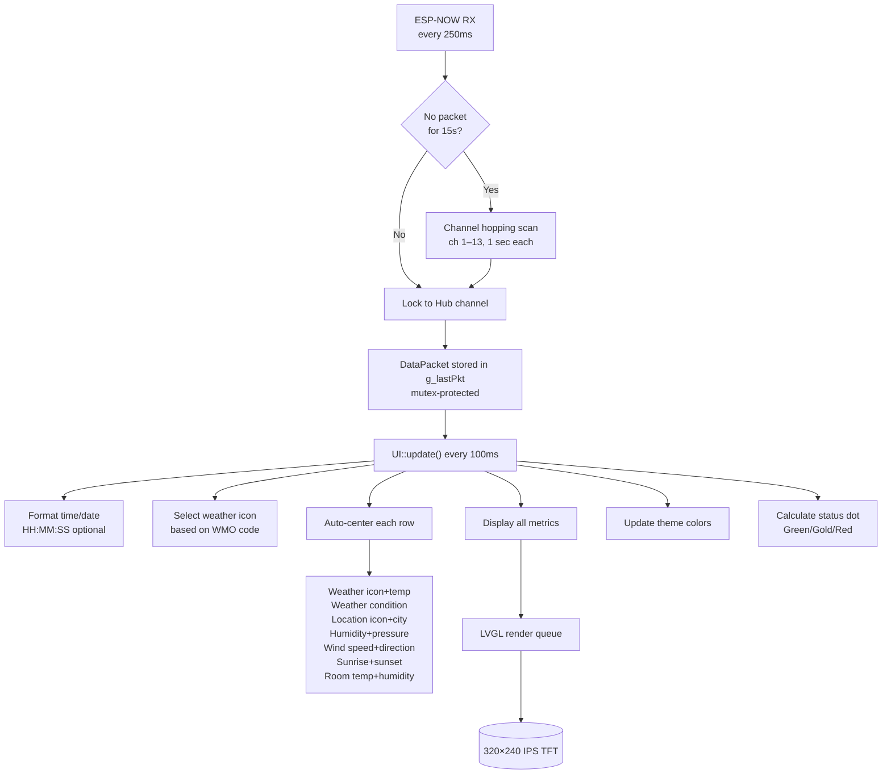
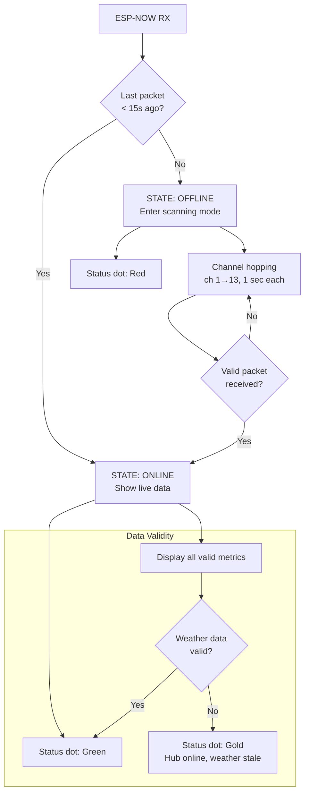
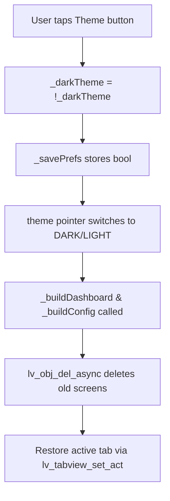

# AmbiSense Architecture

## Overview

AmbiSense is a dual-device local-first weather and room sensor display system:
- **Hub** (ESP32 WROOM-32): Fetches live weather via Wi-Fi, resolves city name from GPS coordinates, aggregates room sensors, broadcasts via ESP-NOW
- **Display** (ESP32-2432S028 CYD): Receives broadcast, renders LVGL dashboard with auto-centering, allows user config

Both devices are independent; can develop/test separately. Communication via ESP-NOW (no router required).

---

## Hub Architecture

### Hardware
- ESP32 (WROOM-32)
- DHT22 (temperature/humidity sensor)
- DS3231 (real-time clock, accurate timekeeping)
- Wi-Fi antenna
- USB power or 5V battery

### Modules

**Network** (`include/network/network.h` / `src/network/network.cpp`)
- ESP-NOW RX callback
- Parses DataPacket from Hub
- Channel auto-sync: locks to Hub's Wi-Fi channel on first packet
- **Offline detection & channel hopping:** If no valid DataPacket is received for 15 seconds, the Display enters a scanning state. It sequentially hops through Wi-Fi channels 1–13 (every 1 second) until the Hub is found again. Once a packet arrives, the Display locks to that channel and resumes normal operation.
- Sends ConfigPacket to update credentials
- Sends CmdPacket for commands (e.g., force NTP sync)
- Loads/saves credentials from NVS (Preferences API, namespace `"ambisense"`)

**Weather** (`include/services/weather/weather.h` / `src/services/weather/weather.cpp`)
- Fetches current weather from Open-Meteo API (free, no API key)
- Handles retries with exponential backoff (initial: 2s, max 3 retries)
- Caches weather data; refreshes on 30-minute interval (`WEATHER_INTERVAL_MS`)
- Returns WeatherData struct with temp, humidity, pressure, wind, sunrise/sunset, WMO code
- Runs in FreeRTOS task (background thread) to avoid blocking
- Thread-safe access via mutex

**LocationResolver** (`include/services/location/location_resolver.h` / `src/services/location/location_resolver.cpp`)
- Resolves city name from GPS coordinates using Nominatim (OpenStreetMap) reverse geocoding
- Fetches once at boot, caches result
- Falls back to "Unknown" if lookup fails
- Thread-safe, no API key required
- Uses OpenStreetMap's Nominatim API with proper User-Agent header

**Sensors** (`include/sensors/sensors.h` / `src/sensors/sensors.cpp`)
- Polls DHT22 every 2 seconds (`DHT_INTERVAL_MS`)
- Reads temperature, humidity
- Caches last valid reading; marks invalid if read fails
- Validity check: `!isnan(temp) && !isnan(humidity)`

**RTCManager** (`include/time/rtc_manager.h` / `src/time/rtc_manager.cpp`)
- Interfaces with DS3231 real-time clock
- Provides accurate timestamp independent of WiFi
- NTP sync state machine: `IDLE → SYNCING → DONE / FAILED`
- Syncs with NTP once WiFi+internet available
- Daily scheduled sync at configurable time (default 12:00)
- Source of truth for all timestamps in DataPacket

**Main Loop** (`src/main.cpp`)
1. `sensors.update()` — Poll DHT22 if interval elapsed
2. `rtc.update(network.isConnected(), network.getNTPServer())` — Check/perform NTP sync
3. `network.update()` — Maintain WiFi, broadcast DataPacket every 250ms

### Data Flow (Hub)



### Packet Structure

All packets defined in `include/config/Config.h` (shared):

**DataPacket** (Hub → Display, broadcast every 250ms, ~100 bytes)
```cpp
uint8_t  type              // PACKET_TYPE_DATA (0x01)
uint8_t  seq               // Rolling sequence (0–255)
uint8_t  channel           // Wi-Fi channel (for Display auto-sync)
uint8_t  wifiConnected     // 1 = Hub on Wi-Fi, 0 = offline
uint32_t timestamp         // Unix timestamp from RTC

// Location
uint8_t  locationValid     // 1 = city name valid, 0 = unknown
char     city[33]          // City name (e.g., "Bangkok")

// Weather
uint8_t  weatherValid
uint8_t  weatherCode       // WMO code
float    outsideTemp       // °C
float    apparentTemp      // "feels like"
uint8_t  outsideHumi       // %
uint16_t outsidePress      // hPa
float    windSpeed         // km/h
int16_t  windDirection     // degrees (0–360)
char     sunrise[8]        // HH:MM
char     sunset[8]         // HH:MM

// Room
uint8_t  roomValid
float    roomTemp          // °C
float    roomHumi          // %
```

**ConfigPacket** (Display → Hub, on-demand, ~165 bytes)
- SSID (32 bytes), password (63 bytes), NTP server (63 bytes), seq

**CmdPacket** (Display → Hub, on-demand)
- Command ID (e.g., CMD_FORCE_NTP_SYNC), seq

**AckPacket** (bidirectional)
- Echoes seq of received packet

---

## Display Architecture

### Hardware
- ESP32-2432S028 CYD (Cheap Yellow Display)
  - Built-in ESP32
  - 2.8" 320×240 ILI9341 IPS TFT LCD
  - XPT2046 capacitive touch controller
  - SPI interface
- USB power or barrel jack (5V)

### Modules

**DisplayManager** (`include/display/display_manager.h` / `src/display/display_manager.cpp`)
- LVGL initialization and lifecycle
- TFT_eSPI driver for LCD rendering
- XPT2046 touch input handling
- Provides `isTouched()` and `getTouch()` for UI event handling
- Frame rate: ~60 FPS via LVGL

**Network** (`include/network/network.h` / `src/network/network.cpp`)
- ESP-NOW RX callback
- Parses DataPacket from Hub
- Channel auto-sync: locks to Hub's Wi-Fi channel on first packet
- Offline detection: uses pkt.timestamp validity
- Sends ConfigPacket to update credentials
- Sends CmdPacket for commands (e.g., force NTP sync)
- Loads/saves credentials from NVS (Preferences API, namespace `"ambisense"`)

**UI** (`include/display/ui.h` / `src/display/ui.cpp`)
- LVGL v8.4.0 dashboard rendering (320×240 IPS TFT)
- **Auto-centering**: All UI rows recalculate positions on every update based on actual text width using empirically-determined gap values
- Two screens:
  - **DASHBOARD**: Weather card, room sensors, time/date, status dot
  - **CONFIG**: Two tabs
    - Tab 1: Wi-Fi/NTP input fields with persistent credentials, force sync button, show password toggle
    - Tab 2: Dark/light theme toggle, show/hide seconds, date format dropdown
- Dual themes (dark/light) with persistent palettes
- Non-blocking updates; all rendering deferred to `update()` calls
- Touch input callbacks for buttons and text fields
- Palettes: DARK (default) and LIGHT
- **Fonts**: Montserrat (various sizes) + Inconsolata (14px, 16px) + Material Design icons

**UI Features**
- **Show Password** — Toggle password visibility with eye icon (open/closed)
- **Persistent Credentials** — SSID, Password, NTP server saved to NVS
- **Auto-Scroll** — Text fields scroll into view when focused
- **Tab Change** — Keyboard automatically hides when switching tabs

**WeatherTypes** (`include/weather/weather_types.h` / `src/weather/weather_types.cpp`)
- Shared struct definitions (WeatherInfo, UNKNOWN_WEATHER)
- Weather enum and helper functions (icon lookup, WMO code mapping)
- Wind direction conversion (degrees to cardinal direction)

**Main Loop** (`src/main.cpp`)
1. `display.update()` — Handle LVGL, process touch input
2. `network.update()` — Receive DataPackets
3. Every 100ms: `ui.update(pkt, network.isOnline())` — Refresh dashboard with full DataPacket

### Data Flow (Display)



### Offline Detection & Recovery

The Display uses a state machine to detect and recover from Hub disconnections:



| State | Condition | Behavior |
|-------|-----------|----------|
| **ONLINE** | Packet received within 15s | Live data displayed, status dot green |
| **STALE** | Packet received but `weatherValid=0` | Metrics show placeholders, dot gold |
| **OFFLINE** | No packet for 15s | Channel scanning active (ch 1–13 loop), dot red |

**Recovery Process:**
1. Display detects missing packets via `g_lastPktMs` timestamp
2. Enters scanning mode, hopping channels every 1 second
3. Locks to the first channel that receives a valid DataPacket
4. Immediately resumes normal operation with live data

**Note:** The Hub itself has no offline detection — it broadcasts continuously regardless of internet connectivity.

### UI Auto-Centering

All rows in `_updateDashboard()` recalculate positions on every update:

| Row | Components | Gap Values (from UIConfig.h) |
|-----|-----------|------------------------------|
| 1 | Weather icon + temp | `R1_ICON_GAP = 5`, `R1_X_OFFSET = -2` |
| 2 | Weather condition | Container-based, auto-marquee if text too long |
| 3 | Location icon + city | `R3_ICON_GAP = 1`, `R3_X_OFFSET = -3` |
| 5 | Humidity icon + value + spacer + Pressure icon + value | `R5_HUMI_GAP = 0`, `R5_PAIR_GAP = 10`, `R5_PRESS_GAP = 4`, `R5_X_OFFSET = -4` |
| 6 | Wind icon + value | `R6_ICON_GAP = 4`, `R6_X_OFFSET = -3` |
| 7 | Sunrise icon + value + spacer + Sunset icon + value | `R7_ICON_GAP = 4`, `R7_PAIR_GAP = 10`, `R7_X_OFFSET = -3` |
| 8 | Room temp icon + value + spacer + Room humidity icon + value | `R8_TEMP_GAP = 0`, `R8_PAIR_GAP = 11`, `R8_HUMI_GAP = 0`, `R8_X_OFFSET = -4` |

Position formula: `sx = (VDIV_X - total_width) / 2 + offset`

### UI State

**Palette** struct with theme colors:
- Dark theme (default): black BG, white text, orange/blue/green accents
- Light theme: light gray BG, dark text, adjusted colors

**Screen enum**: DASHBOARD, CONFIG

**Global state** (mutex-protected in main.cpp):
- `g_lastPkt` — Last received DataPacket
- `g_lastPktMs` — Timestamp of last packet (millis)

**Timeout behavior**: Display uses pkt.timestamp validity; if timestamp invalid, shows placeholders.

---

## Communication Protocol

### Packet Types

- **PACKET_TYPE_DATA** (0x01) — Hub broadcasts every 250ms
- **PACKET_TYPE_CONFIG** (0x02) — Display sends credential update
- **PACKET_TYPE_ACK** (0x03) — Either device echoes seq
- **PACKET_TYPE_CMD** (0x04) — Display sends commands (e.g., force NTP sync)

### Commands

- **CMD_FORCE_NTP_SYNC** (0x01) — Hub immediately syncs RTC with NTP

### ESP-NOW Details

- Broadcast address: `{0xFF, 0xFF, 0xFF, 0xFF, 0xFF, 0xFF}`
- No encryption
- Display auto-locks to Hub's Wi-Fi channel on first packet
- Works even if Hub has no internet
- Typical latency <50ms

### Offline Detection

- Display checks `pkt.timestamp >= 1000000000UL` (Unix epoch threshold)
- If timestamp invalid: shows placeholders (`--°C`, `Unknown`, etc.)
- Status dot turns red when `hubOnline` flag is false
- No separate 5-second timeout; relies on packet timestamp validity

---

## Configuration Files

### Shared: `Config.h`
Protocol definitions, intervals, packet types (shared by both Hub and Display)

- `DEBUG_NETWORK = 0` — Log ESP-NOW packets
- **TIME**: `GMT_OFFSET_SEC = 7*3600` (UTC+7, Bangkok), `DAYLIGHT_OFFSET_SEC = 0` (no DST), `TARGET_SYNC_HOUR = 12`, `TARGET_SYNC_MINUTE = 0`
- **WEATHER**: `WEATHER_INTERVAL_MS = 1,800,000` (30 min), `WEATHER_RETRY_DELAY_MS = 2000`, `WEATHER_MAX_RETRIES = 3`
- **INTERVALS**: `DHT_INTERVAL_MS = 2000`, `BROADCAST_INTERVAL_MS = 250`, `SCAN_HOP_INTERVAL_MS = 1000`, `SYNC_CHECK_INTERVAL_MS = 1000`
- **ESP-NOW**: Broadcast address, packet types, command IDs
- **PACKET STRUCTS**: DataPacket, ConfigPacket, CmdPacket, AckPacket

### Device-Specific: `HardwareConfig.h`

**Hub** pins:
- DHT22: GPIO 25
- DS3231 I2C: SDA GPIO 33, SCL GPIO 32

**Display** pins:
- TFT SPI: CS 5, DC 4, CLK 18, MOSI 23, MISO 19
- Touch SPI: CS 32, CLK 25, MOSI 33, MISO 27
- Backlight: GPIO 14

### User-Editable: `LocationConfig.h`

- `LOCATION_LAT`, `LOCATION_LON` — Coordinates for weather API AND reverse geocoding
- `LOCATION_NAME` — Display string (e.g., "Bangkok") — fallback if geocoding fails
- Note: LocationResolver uses Nominatim API; no API key required

### UI Layout: `UIConfig.h`

Separate config file for all UI layout constants:
- Screen dimensions (320×240)
- Clock size and position
- Row offsets (empirical centering values)
- Row gaps (empirical spacing values)
- Derived constants (CLK_X, CLK_Y, VDIV_X)

---

## Timeout Constants

All timeout values are defined in `Config.h` and shared between Hub and Display:

| Constant | Value | Description |
|----------|-------|-------------|
| `HUB_OFFLINE_TIMEOUT_MS` | 15000 | Time without DataPacket before Display assumes Hub offline |
| `STALE_DATA_TIMEOUT_MS` | 5000 | Time after which weather/room data is considered stale |
| `WIFI_CONNECT_TIMEOUT_MS` | 15000 | Max time to wait for Wi-Fi connection |
| `WIFI_RETRY_INTERVAL_MS` | 30000 | Backoff between Wi-Fi reconnection attempts |
| `NTP_SYNC_TIMEOUT_DELAY_MS` | 10000 | Per-attempt timeout for NTP sync |
| `NTP_SYNC_MAX_RETRIES` | 6 | Maximum NTP sync attempts before giving up |
| `SCAN_HOP_INTERVAL_MS` | 1000 | Time between channel hops during Display scanning |
| `SYNC_CHECK_INTERVAL_MS` | 1000 | RTC sync state machine check frequency |

These constants are tuned for reliability — adjusting them may affect system responsiveness.

---

## Design Patterns

### Non-Blocking Architecture

- No `delay()` anywhere
- All timing based on `millis()`
- Sensor reads polled on demand
- Commands processed asynchronously
- Weather fetch runs in FreeRTOS task (doesn't block main loop)

### Graceful Offline Fallback

- Display shows placeholders if Hub timestamp invalid
- No UI freeze or hang
- Syncs automatically when Hub comes back online

### NVS Storage

- Hub: credentials in namespace `"ambisense"`
- Display: credentials in namespace `"ambisense"`
- Display: UI preferences (theme, seconds, date format, saved SSID/password/NTP) in namespace `"ui_prefs"`
- Loaded once on boot, updated on config change
- Persistent across power cycles

### Channel Auto-Sync

- Display locks to Hub's Wi-Fi channel on first DataPacket
- Simplifies ESP-NOW discovery (no scanning)
- Survives Wi-Fi channel changes

### Broadcast-Only ESP-NOW

- Simpler than point-to-point (no pairing)
- Hub sends continuously; Display receives
- Works even if Display hasn't been introduced to Hub yet

### FreeRTOS Task for Weather

- Weather fetching runs in background task
- Prevents blocking main loop on network latency
- Thread-safe access via mutex

### Reverse Geocoding

- LocationResolver fetches city name once at boot from OpenStreetMap Nominatim
- Cached forever (city name doesn't change)
- No repeated API calls
- Falls back gracefully to "Unknown" if API fails

### Auto-Centering UI

- Each UI row recalculates position on every update
- Uses actual text width after `lv_obj_update_layout()`
- Empirically-determined gap values (measured in Paint)
- Ensures perfect centering even when text length changes (e.g., "25.0°C" vs "26.3°C")

### Theme Switching Implementation

The UI supports Dark/Light theme switching with persistent preferences stored in NVS.

**Theme Switch Flow**



**Palette Structure**

```cpp
struct Palette {
    uint32_t bg;          // Background color
    uint32_t text;        // Primary text
    uint32_t text_invert; // Text on colored backgrounds
    uint32_t subtext;     // Secondary text (dimmed)
    uint32_t dim;         // UI element backgrounds
    uint32_t unknown;     // "Unknown" label color
    uint32_t settings;    // Settings icon color
    uint32_t red;         // Status dot: offline
    uint32_t location;    // Location icon
    uint32_t deep_orange; // Sunset icon
    uint32_t orange;      // Minute hand
    uint32_t gold;        // Sunrise icon
    uint32_t green;       // Status dot: online
    uint32_t wind;        // Wind icon
    uint32_t online;      // Status dot: valid data
    uint32_t pastel_blue; // Pressure icon
    uint32_t sky_blue;    // Humidity icon
};
```

**Async Screen Deletion**

When switching themes, both dashboard and config screens are rebuilt:

```cpp
// Old screens are deleted asynchronously to prevent crashes
if (oldDash) lv_obj_del_async(oldDash);
if (oldConfig) lv_obj_del_async(oldConfig);
```

`lv_obj_del_async()` schedules deletion for the next LVGL tick — this prevents deletion during active rendering cycles, avoiding memory corruption.

**Persistent Preferences**

Theme, date format, and seconds visibility are stored in NVS:

| Key | Type | Default |
|-----|------|---------|
| `darkTheme` | bool | `true` |
| `dateFmtText` | bool | `true` |
| `showSeconds` | bool | `false` |
| `savedSSID` | string | `""` |
| `savedPass` | string | `""` |
| `savedNTP` | string | `pool.ntp.org` |

---

## Performance

| Metric | Value |
|--------|-------|
| ESP-NOW latency | <50ms |
| DataPacket broadcast | 250ms (4 Hz) |
| DHT22 polling | 2 seconds |
| Weather refresh | ~30 minutes |
| Display refresh | ~60 FPS (LVGL) |
| UI update | Every 100ms |
| LocationResolver fetch | Once at boot (~500ms) |
| Power (Hub) | ~1W idle, ~1.5W active |
| Power (Display) | ~0.8W idle, ~1.2W active |
| Total system | ~2W continuous |

---

## Troubleshooting

**Display shows offline (red dot)**
- Hub may not be broadcasting
- Check Hub serial output for errors
- Verify both on same 2.4GHz Wi-Fi band (for channel alignment)
- Hard reset both devices if stuck

**Weather not updating**
- Check Hub: `pio device monitor -b 115200` — look for API errors
- Verify Wi-Fi connection on Hub
- Ensure NTP sync completed (check Hub serial for sync messages)

**Time incorrect**
- Verify Hub's NTP sync (check serial for `NTP sync complete`)
- Ensure NTP server is reachable
- Check timezone in `Config.h` (default UTC+7)

**Config changes not persisting**
- NVS save may fail due to flash wear
- Try erasing NVS and reflashing: `pio run -t erase`
- Check serial output for NVS errors

**Display won't connect to Hub**
- Verify both on same 2.4GHz Wi-Fi network
- Hard reset both: power cycle and reflash if needed
- Check ESP-NOW init in serial logs (both should print init messages)

**City name shows "Unknown"**
- Check LocationResolver serial output: `[GEO] Location: ...` or `[GEO] Location lookup failed`
- Verify LOCATION_LAT/LOCATION_LON in LocationConfig.h are correct
- Ensure Hub has internet during boot (geocoding requires API call)
- Nominatim API is free but requires valid User-Agent header (already set)

**UI elements misaligned**
- Auto-centering recalculates on each update
- Gap values are empirical (measured in Paint); adjust constants in `UIConfig.h` if needed
- Ensure `_buildDashboard()` and `_updateDashboard()` use identical gap values

**Keyboard covers text fields**
- Dynamic padding should handle this
- Check `_onTaEvent` callback if padding isn't restored properly

---

## Current Status

- Both Hub and Display fully functional
- Clock synchronizes via NTP, sensors read and transmit
- UI renders live with dual themes and auto-centering
- LocationResolver fetches city name from GPS coordinates
- Offline mode shows placeholders when Hub timestamp invalid
- Show Password button with eye icon toggle
- SSID, Password, NTP server persist across reboots
- Tab change hides keyboard automatically
- Ready for deployment