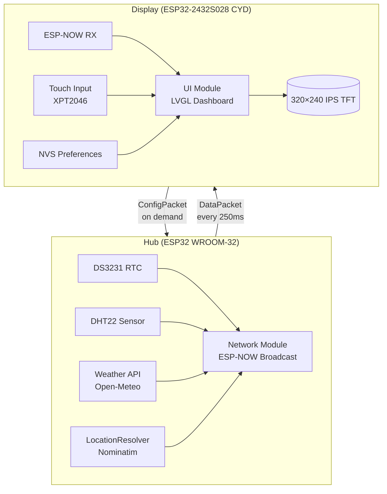

# AmbiSense

*This project was developed with AI-assisted code generation and human oversight.*


Real-time ambient weather and room sensor display system. ESP32 Hub fetches live weather via Wi-Fi, resolves city name from GPS coordinates via OpenStreetMap, and broadcasts to an ESP32-2432S028 Display over ESP-NOW. The dashboard auto-centers all UI elements for perfect alignment regardless of value length.

## Features

- **Live Weather** — Temperature, humidity, pressure, wind speed/direction, sunrise/sunset via Open-Meteo API (free, no key required)
- **Room Metrics** — DHT22 temperature and humidity
- **Auto-Centering UI** — Every row recalculates position based on actual text width
- **Dual Themes** — Dark/Light with persistent preferences in NVS
- **Configurable** — Wi-Fi credentials, NTP server, date format, show/hide seconds
- **Offline Resilient** — Shows placeholders (`--°C`, `Unknown`) when Hub is unreachable
- **ESP-NOW Communication** — Low-latency (~50ms), no router required, auto-channel sync
- **Reverse Geocoding** — City name resolved from GPS coordinates via Nominatim (no API key)

## Prerequisites

Before building and flashing, ensure you have:

- [PlatformIO IDE](https://platformio.org/install) (VS Code extension or CLI)
- ESP32 USB drivers ([CP210x](https://www.silabs.com/developers/usb-to-uart-bridge-vcp-drivers) or [CH340](https://www.wch.cn/download/CH341SER_EXE.html) depending on your board)
- USB cable (data-capable, not just charging)

The project uses PlatformIO's dependency management — all required libraries will be automatically downloaded during the first build.

## UI Features

### Dual Themes
Toggle between Dark and Light themes in the settings screen. Preferences persist across reboots via NVS.

| Dark Theme | Light Theme |
|------------|-------------|
|  |  |

### Config Screen
- **Show Password** — Toggle password visibility with eye icon
- **Persistent Credentials** — SSID, Password, NTP server saved to NVS
- **Auto-Scroll** — Text fields scroll into view when focused
- **Tab Change** — Keyboard automatically hides when switching tabs

### Dashboard Auto-Centering
Every UI row recalculates position on each update using actual text widths and empirically-determined gaps. Ensures perfect centering even when values change length (e.g., "25.0°C" → "26.3°C").

| Config Screen | Settings Tab |
|---------------|--------------|
|  |  |

## Architecture



## Quick Start

### 1. Configure Hub Location

Edit `hub/include/config/LocationConfig.h`:

```
constexpr float LOCATION_LAT = 40.7128;   // Your latitude
constexpr float LOCATION_LON = -74.0060;  // Your longitude
```

### 2. Flash Hub

```
cd hub/
pio run -t upload
pio device monitor -b 115200
```

Expected output:

```
[MAIN] AmbiSense Hub booting...
[RTC] DS3231 INIT
[GEO] LocationResolver INIT
[NET] ESP-NOW INIT
[NET] Config loaded: SSID: YOUR_SSID_HERE
[MAIN] Boot complete.
[NET] Connected to IP: 192.168.x.xxx
[GEO] Location resolved: New York
[WEATHER] Data fetched successfully
```

### 3. Flash Display

```
cd display/
pio run -t upload
pio device monitor -b 115200
```

Expected output:

```
[MAIN] AmbiSense Display booting...
[DISP] DisplayManager initialized.
[NET] ESP-NOW INIT
[UI] Initialized.
[MAIN] Boot complete.
[NET] LOCKED to Hub Channel: 4
```

## Hardware Requirements

### Hub

- ESP32 (WROOM-32)
- DHT22 (temperature/humidity sensor)
- DS3231 (real-time clock)
- Wi-Fi antenna

### Display

- ESP32-2432S028 CYD (320×240 IPS TFT, capacitive touch)

## Configuration

### Via Display Settings (Recommended)

Tap **⚙️** (bottom-right) to configure:

| Setting | Description |
|---------|-------------|
| Wi-Fi SSID | Hub network name |
| Password | Hub network password |
| NTP Server | Time server (default: `pool.ntp.org`) |
| Theme | Dark / Light (persists) |
| Show Seconds | Toggle clock seconds (persists) |
| Date Format | Text (07 Mar 2024) / Numeric (07/03/2024) (persists) |

All settings persist across reboots via NVS.

### Manual Configuration

| File | Setting | Default |
|------|---------|---------|
| `Config.h` | `GMT_OFFSET_SEC` | `7*3600` (UTC+7) |
| `Config.h` | `WEATHER_INTERVAL_MS` | `30*60*1000` |
| `LocationConfig.h` | `LOCATION_LAT` / `LOCATION_LON` | Required |
| `UIConfig.h` | Screen layout constants | 320×240 |

## Packet Protocol

**DataPacket** (Hub → Display, ~100 bytes):

| Field | Size | Description |
|-------|------|-------------|
| `type` | 1 | `PACKET_TYPE_DATA` (0x01) |
| `seq` | 1 | Rolling sequence number |
| `channel` | 1 | Wi-Fi channel for auto-sync |
| `timestamp` | 4 | Unix timestamp from RTC |
| `locationValid` | 1 | 1 = city name valid |
| `city` | 33 | Location name |
| `weatherValid` | 1 | 1 = weather data valid |
| `weatherCode` | 1 | WMO weather code |
| `outsideTemp` | 4 | °C |
| `apparentTemp` | 4 | "Feels like" °C |
| `outsideHumi` | 1 | % |
| `outsidePress` | 2 | hPa |
| `windSpeed` | 4 | km/h |
| `windDirection` | 2 | Degrees (0–360) |
| `sunrise` | 8 | HH:MM |
| `sunset` | 8 | HH:MM |
| `roomValid` | 1 | 1 = room data valid |
| `roomTemp` | 4 | °C |
| `roomHumi` | 4 | % |

## Status Indicators

| Dot Color | Meaning |
|-----------|---------|
| 🟢 Green | Hub online, weather valid |
| 🟡 Gold | Hub online, weather stale (no internet) |
| 🔴 Red | Hub offline |

## Project Structure

```
AmbiSense/
├── display/               # ESP32-2432S028 Display firmware
│   ├── include/
│   │   ├── config/        # Config, HardwareConfig, UIConfig
│   │   ├── display/       # display_manager.h, ui.h
│   │   ├── fonts/         # LVGL font headers
│   │   ├── network/       # network.h
│   │   └── weather/       # weather_types.h
│   ├── src/
│   │   ├── display/       # display_manager.cpp, ui.cpp
│   │   ├── fonts/         # Font bitmaps (.c)
│   │   ├── network/       # network.cpp
│   │   ├── weather/       # weather_types.cpp
│   │   └── main.cpp
│   ├── lv_conf.h
│   ├── platformio.ini
│   └── User_Setup.h
├── hub/                   # ESP32 Hub firmware
│   ├── include/
│   │   ├── config/        # Config, HardwareConfig, LocationConfig
│   │   ├── network/       # network.h
│   │   ├── sensors/       # sensors.h
│   │   ├── services/
│   │   │   ├── location/  # location_resolver.h
│   │   │   └── weather/   # weather.h
│   │   └── time/          # rtc_manager.h
│   ├── src/
│   │   ├── network/       # network.cpp
│   │   ├── sensors/       # sensors.cpp
│   │   ├── services/
│   │   │   ├── location/  # location_resolver.cpp
│   │   │   └── weather/   # weather.cpp
│   │   ├── time/          # rtc_manager.cpp
│   │   └── main.cpp
│   └── platformio.ini
├── docs/
│   ├── Code_Layout_Standard.md
│   └── MDI_Symbols.md
├── AmbiSense_ARCHITECTURE.md
└── README.md
```

## Troubleshooting

| Symptom | Likely Fix |
|---------|------------|
| Red indicator dot | Check Hub power; both on same 2.4GHz band |
| "Unknown" city | Hub needs internet at boot; check `LOCATION_LAT`/`LON` |
| Time incorrect | NTP sync required; check `GMT_OFFSET_SEC` |
| Config not saving | `pio run -t erase` |
| Keyboard covers text fields | Dynamic padding should handle this; check `_onTaEvent` callback |
| Theme switch crashes | Async deletion fix applied; update if still occurs |

## Performance

| Metric | Value |
|--------|-------|
| ESP-NOW latency | <50ms |
| Broadcast rate | 250ms (4Hz) |
| Sensor polling | 2 seconds |
| Weather refresh | 30 minutes |
| Display FPS | ~60 FPS |
| Power (total) | ~2W |

## Customization

| Aspect | File | Setting |
|--------|------|---------|
| Timezone | `Config.h` | `GMT_OFFSET_SEC` |
| Weather interval | `Config.h` | `WEATHER_INTERVAL_MS` |
| Theme colors | `ui.cpp` | `DARK` / `LIGHT` palettes |
| Location | `LocationConfig.h` | `LOCATION_LAT` / `LOCATION_LON` |
| UI Layout | `UIConfig.h` | Screen size, margins, gaps |

## For Developers

This project enforces a strict code layout standard documented in [`docs/Code_Layout_Standard.md`](docs/Code_Layout_Standard.md). Key rules:

- One logical module per file
- Headers declare public API only — no implementation
- Source files contain all implementation and internal state
- Comment hierarchy: T1 (file header) → T7 (inline notes)

When contributing, follow the visual hierarchy scale defined in the standard document.

## Links

- [LVGL Documentation](https://docs.lvgl.io/)
- [ESP-NOW Guide](https://docs.espressif.com/projects/esp-idf/en/latest/esp32/api-reference/network/esp_now.html)
- [Open-Meteo API](https://open-meteo.com/)
- [Nominatim Geocoding](https://nominatim.openstreetmap.org/)

## License

MIT